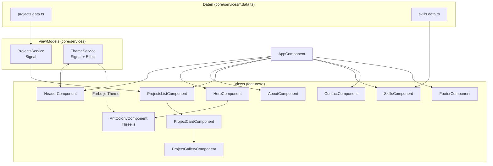

# Portfolio – daniel-fast.de

Persönliche Portfolio-Website mit Angular, MVVM-Architektur und einer
interaktiven Ameisenkolonie-Simulation als Hero-Element. Automatisches
Deployment nach AWS über GitHub Actions.

🔗 **Live:** [daniel-fast.de](https://daniel-fast.de)

<!-- Hero-Bild hier einfügen, z.B.: -->
<!--  -->


---

## Inhaltsverzeichnis

- [Motivation](#motivation)
- [Projektübersicht](#projektübersicht)
- [Features](#features)
- [Technologien](#technologien)
- [Architektur](#architektur)
- [Installation](#installation)
- [Verwendung](#verwendung)
- [Bilder](#bilder)
- [Softwarestruktur](#softwarestruktur)
- [Projektstruktur](#projektstruktur)
- [Deployment](#deployment)
- [Herausforderungen & Lösungen](#herausforderungen--lösungen)
- [Entwicklungsstand](#entwicklungsstand)
- [Roadmap](#roadmap)
- [Lessons Learned](#lessons-learned)
- [Bekannte Probleme](#bekannte-probleme)
- [Zukünftige Erweiterungen](#zukünftige-erweiterungen)
- [Lizenz](#lizenz)
- [Autor](#autor)

---

## Motivation

Diese Seite ist meine persönliche Visitenkarte im Netz: ein Ort, an dem ich
zeige, woran ich arbeite, welche Technologien ich nutze und wie ich mich
weiterentwickle. Gleichzeitig ist sie selbst ein Übungsprojekt für Frontend-
Architektur, CI/CD und den bewussten Umgang mit KI-gestützter Entwicklung.

## Projektübersicht

Der komplette Code wurde KI-generiert (iterativ mit einem LLM entwickelt).
Mein eigener Beitrag lag im **iterativen Design- und Architektur-Feedback**
(Struktur, UX-Entscheidungen, visuelle Ausrichtung) sowie in **kleineren
eigenen Code-Anpassungen**. Das wird bewusst offen kommuniziert – Details
dazu unter [Entwicklungsstand](#entwicklungsstand).

Die Seite ist eine Single-Page-Application ohne Backend. Alle Inhalte
(Projekte, Skills) liegen als typisierte Daten direkt im Frontend-Code und
werden über Angular Signals an die Views gebunden.

## Features

- **Light/Dark Mode** mit Persistierung in `localStorage` und automatischer
  Erkennung der System-Präferenz beim ersten Besuch
- **Interaktive 3D-Ameisenkolonie-Simulation** (Three.js) im Hero-Bereich:
  mehrere "Kolonien" von Agenten laufen mit Pheromon-basierter Pfadfindung
  (ähnlich Ant-Colony-Optimization) über eine simulierte Straße, reagieren
  auf Scroll-Position und passen ihre Farbe automatisch an das aktive Theme an
- **Draggable, endlos scrollbare Projekt-Galerien** pro Projekt-Karte (Maus-
  Drag, kein Snapping, nahtloser Loop durch dreifach geklonte Bildsets)
- **Scroll-Reveal-Animationen** über eine wiederverwendbare Directive
  (`IntersectionObserver`-basiert)
- **Datengetriebene Projekt- und Skills-Listen**: neue Projekte/Skills werden
  ausschließlich durch Bearbeiten zweier TypeScript-Dateien hinzugefügt,
  keine Template-Änderungen nötig
- **Automatisiertes Deployment**: jeder Push auf `main` baut die Seite und
  lädt sie nach S3 hoch, inklusive CloudFront-Cache-Invalidierung

## Technologien

| Bereich          | Technologie                                  |
|-------------------|-----------------------------------------------|
| Framework         | Angular 18 (Standalone Components, Signals)   |
| Sprache           | TypeScript                                    |
| 3D / Grafik       | Three.js                                      |
| Styling           | CSS (Custom Properties für Theming)           |
| Hosting           | AWS S3 (Static Assets) + CloudFront (CDN/SSL) |
| CI/CD             | GitHub Actions                                |
| Tests (Grundgerüst)| Karma / Jasmine (Angular-Standard, ungenutzt)|

## Architektur

Die App folgt einer MVVM-artigen Struktur: Komponenten sind reine Views,
Services fungieren als ViewModels und lesen aus separaten Daten-Dateien.



**Kernprinzip:** Neue Projekte oder Skills erfordern **keine Änderung an
Komponenten oder Templates** – nur an den beiden `*.data.ts`-Dateien.

## Installation

Voraussetzungen: Node.js (empfohlen: aktuelle LTS-Version), npm.

```bash
git clone https://github.com/Minielel/portfolio.git
cd portfolio
npm install
npm start
```

Die Seite läuft anschließend unter `http://localhost:4200`.

## Verwendung

### Neues Projekt hinzufügen

Alles passiert in einer Datei: `src/app/core/services/projects.data.ts`

```ts
{
  id: 'mein-neues-projekt',
  title: 'Mein neues Projekt',
  status: 'live', // 'live' | 'progress' | 'archived'
  description: '...',
  githubUrl: 'https://github.com/...',
  docsUrl: '/projects/mein-neues-projekt/docs', // optional
  techStack: ['Angular', 'AWS'],
  images: [
    { src: 'assets/projects/mein-neues-projekt/bild1.jpg', orientation: 'landscape', caption: '...' },
    { src: 'assets/projects/mein-neues-projekt/bild2.jpg', orientation: 'portrait', caption: '...' }
  ]
}
```

Die Bilddateien kommen nach `public/assets/projects/<projekt-id>/`.
`orientation: 'landscape'` = 16:9, `'portrait'` = 3:4. Beide werden in der
Galerie auf dieselbe Höhe skaliert, das Seitenverhältnis bleibt erhalten.

### Skills anpassen

`src/app/core/services/skills.data.ts` – gleiches Prinzip wie bei den
Projekten: Kategorie + Skill-Liste eintragen, der Rest baut sich automatisch.

### Kontakt-E-Mail ändern

`src/app/features/contact/contact.component.ts` → `email`-Property anpassen.

## Bilder

> **Hinweis:** Aktuell liegen unter `public/assets/projects/` generierte
> Platzhalter-SVGs (Farbverläufe). Vor dem finalen Launch sollten diese durch
> echte Screenshots ersetzt werden. Empfohlene Screenshots:

| Screenshot                          | Beschreibung / Bildunterschrift                                             |
|--------------------------------------|-------------------------------------------------------------------------------|
| Hero-Bereich (Light & Dark)          | "Hero-Sektion mit der 3D-Ameisenkolonie-Simulation und Theme-Toggle."         |
| About-Sektion                        | "Über-mich-Bereich mit Scroll-Reveal-Animation."                              |
| Projekt-Karte mit Galerie            | "Draggable Projekt-Galerie mit Status-Badge und GitHub-Link."                 |
| Skills-Übersicht                     | "Skill-Kategorien als Tag-Gruppen."                                          |
| Mobile Ansicht                       | "Responsives Layout auf einem Smartphone."                                    |
| Deployment-Log (GitHub Actions)      | "Erfolgreicher automatischer Deploy-Workflow nach AWS."                       |

Empfehlung: Screenshots unter `docs/screenshots/` ablegen und im README per
`` einbinden.

## Softwarestruktur

Die Anwendung ist eine reine Frontend-SPA (kein eigenes Backend). Zustand
wird über Angular Signals gehalten (`ThemeService`, `ProjectsService`).
Persistenz beschränkt sich auf das Theme (`localStorage`); alle übrigen
Daten sind statisch im Build enthalten.

## Projektstruktur

```
src/app/
  core/
    models/            -> TypeScript-Interfaces (Project, ProjectImage, ...)
    services/          -> ViewModels (ThemeService, ProjectsService, ...)
                          + Daten (projects.data.ts, skills.data.ts)
  shared/
    directives/        -> RevealDirective (Scroll-Reveal-Animation)
  layout/
    header/            -> Logo + Light/Dark-Toggle
    footer/            -> Social Links, Scroll-to-Top
  features/
    hero/              -> Headline + Ant-Colony-Simulation
    ant-colony/        -> Three.js-Komponente (Pheromon-Pfadfindung)
    about/
    skills/
    projects/
      components/
        project-card/       -> eine Projekt-Sektion (Titel, Status, Links, Galerie)
        project-gallery/    -> draggable, endlos scrollbare Bildergalerie
      projects-list.component.ts
    contact/
```

### Empfohlene zusätzliche Ordner (Projektebene)

```
docs/
  screenshots/         -> echte Screenshots für README/Portfolio
  architecture/         -> ggf. exportierte Diagramme
```

## Deployment

Der Workflow `.github/workflows/deploy.yml` baut das Projekt bei jedem Push
auf `main` und lädt es nach AWS S3 hoch, danach wird der CloudFront-Cache
geleert.

### Einmalige Einrichtung

1. **S3-Bucket** anlegen (Static Website Hosting muss nicht aktiv sein, wenn
   CloudFront über eine Origin Access Control, OAC, direkt aus dem privaten
   Bucket liest).
2. **CloudFront-Distribution** vor den Bucket schalten, eigene Domain als
   Alternate Domain Name (CNAME) eintragen, SSL-Zertifikat über AWS
   Certificate Manager (Region `us-east-1`) einbinden.
3. **DNS**: beim Domain-Provider einen CNAME/ALIAS-Record auf die
   CloudFront-Domain (`xxxxxxxx.cloudfront.net`) anlegen.
4. **IAM-User** mit programmatischem Zugriff anlegen, berechtigt für
   `s3:PutObject`, `s3:DeleteObject`, `s3:ListBucket` auf den Bucket sowie
   `cloudfront:CreateInvalidation` auf die Distribution.
5. Im GitHub-Repo unter *Settings → Secrets and variables → Actions*
   folgende Secrets anlegen:

   | Secret                      | Wert                               |
   |------------------------------|--------------------------------------|
   | `AWS_ACCESS_KEY_ID`          | vom IAM-User                       |
   | `AWS_SECRET_ACCESS_KEY`      | vom IAM-User                       |
   | `AWS_REGION`                 | z. B. `eu-central-1`               |
   | `S3_BUCKET_NAME`             | Name des Buckets                   |
   | `CLOUDFRONT_DISTRIBUTION_ID` | ID der CloudFront-Distribution     |

6. Push auf `main` → der Workflow läuft automatisch (Fortschritt im
   Actions-Tab).

## Herausforderungen & Lösungen

- **Endlos scrollbare Galerie ohne sichtbare Kante**: Die Bildliste wird
  dreifach geklont im DOM gerendert; bei Annäherung an den Rand des
  mittleren Sets springt der `scrollLeft`-Wert unsichtbar zurück in die
  Mitte, sodass beliebig lange in beide Richtungen gescrollt werden kann.
- **Theme-abhängige Farbe der 3D-Objekte**: Die Ameisen-Material-Farbe wird
  nicht hart codiert, sondern zur Laufzeit aus der berechneten
  Hintergrundfarbe des `<body>` abgeleitet (Helligkeitswert via
  Luminanz-Formel), damit sie in Light- und Dark-Mode automatisch passend
  bleibt.
- **Kamera vs. Scroll-Position**: Damit die Simulation beim Scrollen nicht
  "mitläuft", bewegt ausschließlich die Kamera sich mit der Scroll-Position;
  die Weltkoordinaten der Agenten bleiben davon unberührt.

## Entwicklungsstand

**Status: Fertiggestellt / live im Einsatz** unter [daniel-fast.de](https://daniel-fast.de).

**Wichtiger Hinweis zur Entstehung:** Der gesamte Code dieser Seite wurde
KI-generiert (iterative Entwicklung mit einem LLM). Mein eigener Beitrag
bestand aus iterativem Design- und Architektur-Feedback (Struktur, Layout,
UX-Entscheidungen) sowie kleineren eigenen Code-Anpassungen. Diese
Transparenz ist mir wichtig – die Seite dient auch als Beispiel dafür, wie
ich mit KI-gestützten Werkzeugen arbeite und Ergebnisse einordne.

## Roadmap

- [ ] Platzhalter-Screenshots durch echte Bilder ersetzen
- [ ] Weitere eigene Projekte in `projects.data.ts` ergänzen
- [ ] Mobile-Bedienung der Galerie testen/optimieren (Touch-Drag)
- [ ] Grundlegende Unit-Tests für Services (`ThemeService`, `ProjectsService`)
- [ ] Optionale i18n (Deutsch/Englisch) prüfen
- [ ] Lighthouse-/Performance-Audit der Live-Seite

## Lessons Learned

- Datengetriebene Architektur (Trennung von Daten, ViewModel und View) macht
  das Pflegen von Inhalten deutlich einfacher, ohne dass Angular- oder
  Template-Kenntnisse nötig sind, um neue Projekte hinzuzufügen.
- Bei KI-generiertem Code lohnt es sich, Namen und Kommentare kritisch zu
  prüfen: die Simulationskomponente hieß ursprünglich `snake`, obwohl sie
  tatsächlich eine Ameisenkolonie-Simulation implementiert – ein Beispiel
  dafür, wie wichtig eigenes Review auch bei funktionierendem Code ist.
- Iteratives Design-Feedback (auch ohne selbst jede Zeile zu schreiben) ist
  ein eigenständiger, sichtbarer Beitrag zur Qualität eines Projekts.

## Bekannte Probleme

- Galerie-Drag-Interaktion ist aktuell nur für Maus-Events implementiert,
  keine dedizierte Touch-Unterstützung.
- Keine automatisierten Tests vorhanden (Karma/Jasmine-Grundgerüst ist
  Angular-CLI-Standard, aber ungenutzt).
- `app.routes.ts` ist aktuell leer – die Seite ist eine reine
  One-Page-Anwendung ohne Routing.

## Zukünftige Erweiterungen

- Weitere eigene Projekte (Software, Hardware/Embedded) im Portfolio ergänzen
- Eigene Detailseiten pro Projekt (`docsUrl` wird im Datenmodell bereits
  unterstützt, aber noch nicht implementiert)
- Kontaktformular statt reinem `mailto:`-Link
- Automatisierte Lighthouse-Checks im CI-Workflow

## Lizenz

- **Quellcode**: [MIT-Lizenz](LICENSE) – frei nutzbar, veränderbar und
  weiterverwendbar.
- **Inhalte** (Texte, Bilder, persönliche Angaben, Projektbeschreibungen):
  **alle Rechte vorbehalten**, siehe [CONTENT-LICENSE.md](CONTENT-LICENSE.md).
  Diese Inhalte sind persönlich und nicht zur Weiterverwendung freigegeben.

## Autor

**Daniel Fast**
Angehender Informationstechnischer Assistent mit Fokus auf Software, KI,
Elektronik/Embedded Systems und perspektivisch Mechatronik/Robotik.

- GitHub: [@Minielel](https://github.com/Minielel)
- LinkedIn: [daniel-fast](https://www.linkedin.com/in/daniel-fast-5b35a2421/)
- Kontakt: [mail@daniel-fast.de](mailto:mail@daniel-fast.de)
